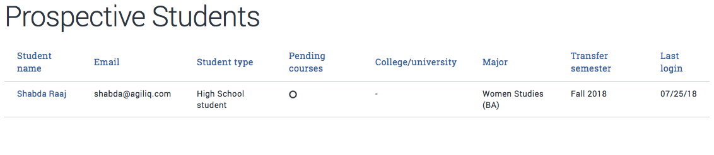

python -m
=================

pretty print a json
---------------------------

:code:`python -m json.tool` will format a string

.. code-block:: bash

    $ cat data/example.json
    [{"fieldname0": "User", "fieldname1": "Country", "fieldname2": "Age"}, {"fieldname0": "Alex", "fieldname1": "US", "fieldname2": "25"}, {"fieldname0": "Ben", "fieldname1": "US", "fieldname2": "24"}, {"fieldname0": "Dennis", "fieldname1": "UK", "fieldname2": "25"}, {"fieldname0": "Yuvi", "fieldname1": "IN", "fieldname2": "24"}](django-admin-cookbook)

    $ cat data/example.json | python -m json.tool
    [
        {
            "fieldname0": "User",
            "fieldname1": "Country",
            "fieldname2": "Age"
        },
        {
            "fieldname0": "Alex",
            "fieldname1": "US",
            "fieldname2": "25"
        },
        {
            "fieldname0": "Ben",
            "fieldname1": "US",
            "fieldname2": "24"
        },
        {
            "fieldname0": "Dennis",
            "fieldname1": "UK",
            "fieldname2": "25"
        },
        {
            "fieldname0": "Yuvi",
            "fieldname1": "IN",
            "fieldname2": "24"
        }
    ]

Expose a folder to a static file server
-------------------------------------------

:code:`python -m http.server` will start a server on port 8000 which will server the files from current dir.

.. code-block:: bash

    $ python -m http.server 8844
    Serving HTTP on 0.0.0.0 port 8844 (http://0.0.0.0:8844/) ...

A simple editor for Python
-------------------------------------------

Every python install comes with the idle editor, you can start it like this :code:`python -m idlelib.idle`

Debugging emails
-------------------
.. code-block:: bash

    $python -m smtpd -n -c DebuggingServer localhost:1025

Profiling scripts
----------------------

.. code-block:: bash

    $python -m cProfile scriptname.py
